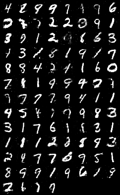

# GAN_mnist
A PyTorch Implementation of [Generative Adversarial Network](https://arxiv.org/abs/1406.2661).

## Requirements
* pytorch
* tensorboardX

## Using 
```
python main.py
```

```
tensorboard --logdir log
```

## Training examples


## Fake examples
 